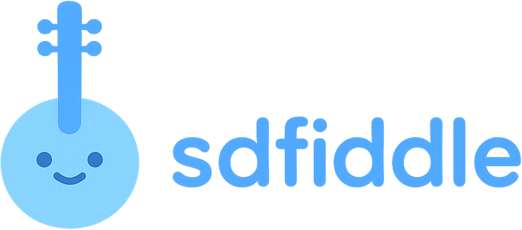

SDFiddle is a browser-based tool for creating 3D graphics with signed distance functions (SDFs). Write shader code and see the results rendered in real-time.

## Features

- Live preview with WebGL rendering
- Code editor with syntax highlighting
- Export to PNG, JPEG, or WebP
- Customizable canvas size and background
- No installation required

## Getting Started

Open SDFiddle in your browser. The left side is the code editor, the right side shows the rendered output. The default example is an animated sphere.

Try modifying values to see what happens:
- Change `0.6` in `sdSphere(p, 0.6)` to adjust the sphere size
- Modify the wobble calculations to change the animation
- Adjust color values in the render function
- Change the camera position by editing `ro` (ray origin)

## What are SDFs?

Signed distance functions describe 3D shapes using math. Instead of polygons or meshes, you define a function that returns the distance from any point in space to the nearest surface. This approach makes it straightforward to blend shapes, animate forms, and create complex geometry with simple equations.

## Resources

For more SDF examples and techniques, check out [Shadertoy](https://www.shadertoy.com).

